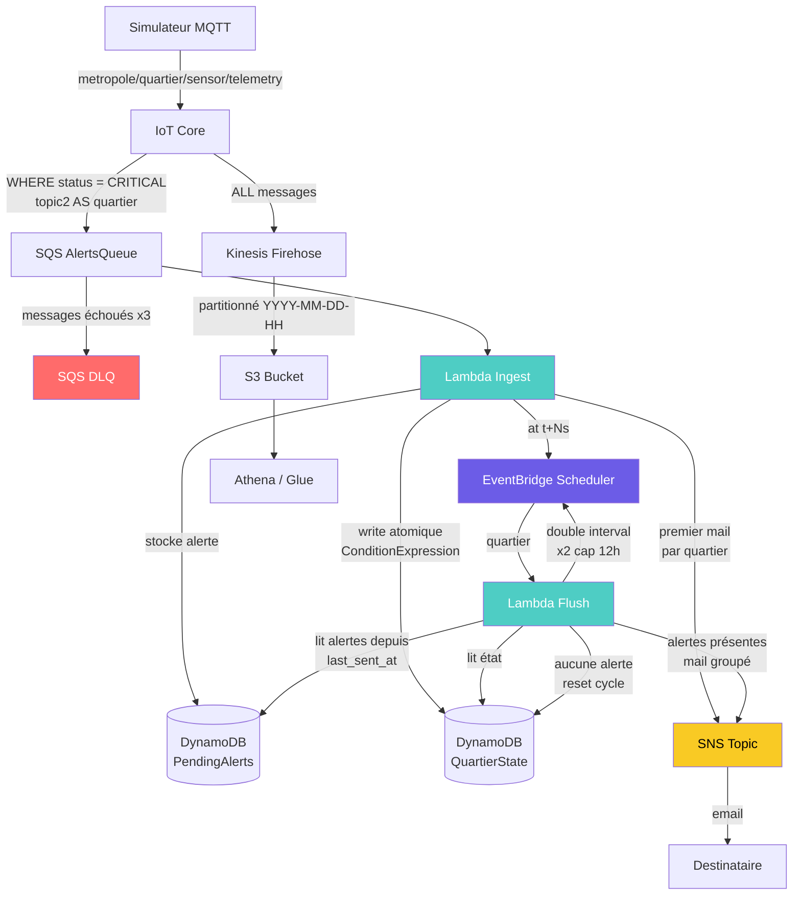

# EcoSense

Pipeline de télémétrie IoT multi-région sur AWS. Les capteurs publient des mesures environnementales via MQTT/mTLS vers IoT Core ; les Topic Rules routent le flux en deux chemins : alertes CRITICAL vers une chaîne d'agrégation par quartier avec backoff exponentiel, et 100% du flux vers Kinesis Firehose pour archivage dans S3 et interrogation via Athena. Deux régions indépendantes (`us-east-1` / `us-east-2`) avec failover côté client.

Le `Makefile` est l'interface principale. Toutes les commandes s'exécutent depuis la racine du dépôt.

## Architecture

## Prérequis

- Python 3.11+
- AWS CLI configuré avec des credentials valides
- Rôle IAM `LabRole` existant dans le compte (environnement AWS Academy)
- `.env` configuré depuis `.env.example`

## Quick start

Copier `.env.example` vers `.env` et renseigner `AWS_ACCOUNT_ID` et `ALERT_EMAIL` avant de commencer.

| Cible | Description |
|---|---|
| `make install` | Crée le venv et installe les dépendances Python |
| `make deploy` | Déploie les stacks CDK (Primary + Secondary si `MULTI_REGION=true`) |
| `make iot-endpoint` | Affiche les endpoints IoT à copier dans `.env` |
| `make certs` | Provisionne les certificats X.509 pour le simulateur |
| `make check` | Teste la connexion MQTT mTLS (exit 0 = OK) |
| `make run` | Lance le simulateur en mode publication |

Consulter `make help` pour la liste complète des cibles disponibles.

## Documentation

- [Infrastructure](docs/infrastructure.md) — composants AWS, flux de données, ressources déployées
- [Scripts et commandes](docs/usage.md) — CDK, provision_certs.py, simulator_mqtt.py, AWS CLI
