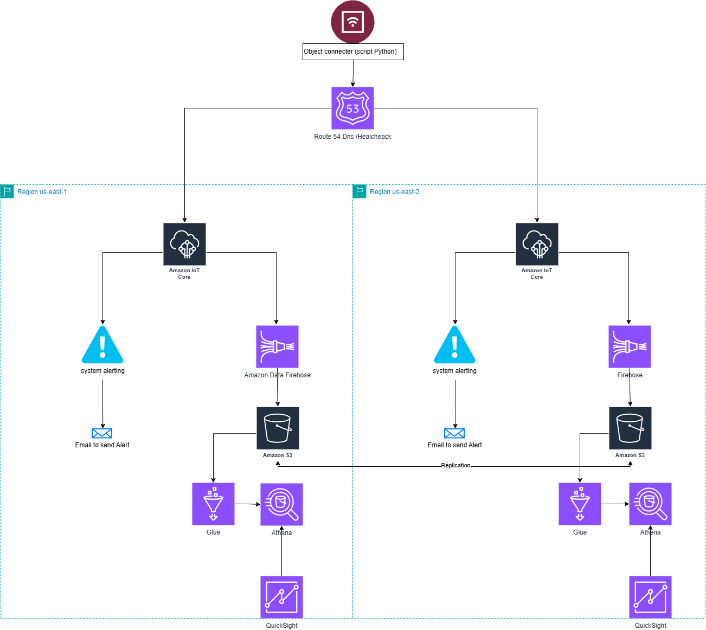

# EcoSense


Pipeline de télémétrie IoT multi-région sur AWS. Les capteurs publient des mesures environnementales via MQTT/mTLS vers IoT Core ; les Topic Rules routent le flux en deux chemins : alertes CRITICAL vers une chaîne d'agrégation par quartier avec backoff exponentiel, et 100% du flux vers Kinesis Firehose pour archivage dans S3 et interrogation via Athena. Deux régions indépendantes (`us-east-1` / `us-west-2`) avec failover côté client.

Le `Makefile` est l'interface principale. Toutes les commandes s'exécutent depuis la racine du dépôt.

## Architecture



Schémas Draw.io éditables dans `docs/img/Drowio/` :
- [`EcosensV4Archi.drawio`](docs/img/Drowio/EcosensV4Archi.drawio) — architecture générale multi-région
- [`ecosense_alerting.drawio`](docs/img/Drowio/ecosense_alerting.drawio) — pipeline d'alertes CRITICAL

## Prérequis

- Python 3.11+
- AWS CLI configuré avec des credentials valides
- Rôle IAM `LabRole` existant dans le compte (environnement AWS Academy)
- `.env` configuré depuis `.env.example`

## Quick start

Copier `.env.example` vers `.env` et renseigner au minimum `AWS_ACCOUNT_ID` et `ALERT_EMAIL` avant de commencer.

```bash
cp .env.example .env
# Éditer .env : AWS_ACCOUNT_ID, ALERT_EMAIL
make bootstrap        # venv + dépendances + bucket CDK
make deploy           # déployer les stacks
make iot-endpoint     # copier les endpoints IoT dans .env
make certs            # provisionner les certificats X.509
make check            # tester la connexion MQTT mTLS
make run              # lancer le simulateur
```

| Cible | Description |
|---|---|
| `make bootstrap` | Premier démarrage : venv + dépendances + bucket CDK |
| `make deploy` | Déploie les stacks CDK (Primary seul par défaut, `MULTI_REGION=true` pour les deux) |
| `make iot-endpoint` | Affiche les endpoints IoT à copier dans `.env` |
| `make certs` | Provisionne les certificats X.509 pour le simulateur |
| `make check` | Teste la connexion MQTT mTLS (exit 0 = OK) |
| `make run` | Lance le simulateur en mode publication |
| `make destroy` | Vide les buckets et détruit tous les stacks |

Si `make deploy` échoue, il affiche les vérifications à faire (bucket CDK, `.env`, dépendances Python).

Consulter `make help` pour la liste complète des cibles disponibles.

## Documentation

### Projet
- [Sujet](Sujet.md) — scénario métier, architecture implémentée, déviation vs sujet prescrit, crash-tests
- [Journal de bord](PlaningEquipe.md) — répartition des tâches par membre et par jour

### Architecture
- [Infrastructure](docs/infrastructure.md) — composants AWS déployés, flux de données, ressources par région
- [Architecture cible](docs/architecture-cible.md) — architecture production cible (Route 53, CRR, KMS, sécurité complète)
- [ADR — Architecture Decision Records](docs/adr.md) — décisions techniques structurantes (IoT Core vs SNS, Firehose vs Lambda, failover client-side, régions)
- [Limitations et améliorations](docs/limitations-et-ameliorations.md) — contraintes AWS Academy, delta actuel → production

### Exploitation
- [Runbooks](docs/runbook.md) — procédures de résolution des pannes critiques (basculement, certificat, Firehose, SNS, lab restart)
- [Scripts et commandes](docs/usage.md) — référence CDK, provision_certs.py, simulator_mqtt.py, AWS CLI
