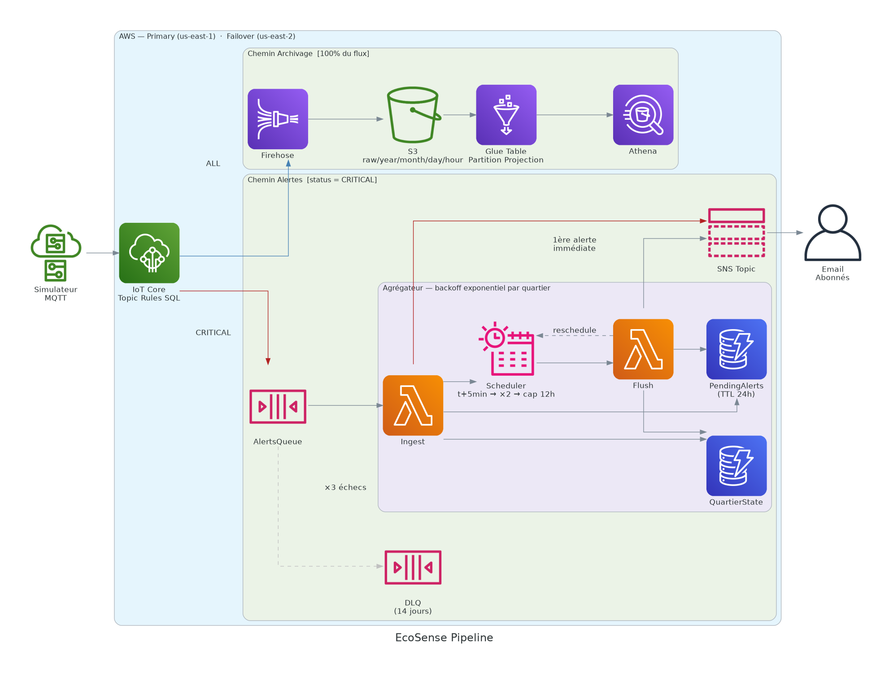

# Infrastructure EcoSense

---

## Vue d'ensemble



```
Simulateur MQTT (mTLS)
  └─→ IoT Core — Topic Rules SQL
       ├─→ [status = CRITICAL]  → SQS → Lambda Ingest ─┐
       │                                                 ├─→ DynamoDB (état + buffer)
       │                                           Lambda Flush ←── EventBridge Scheduler
       │                                                 └─→ SNS → Email abonnés
       └─→ [100% du flux]  → Kinesis Firehose → S3 → Glue / Athena
```

Deux régions déployées de manière identique et indépendante :

| Région | Rôle |
|---|---|
| `us-east-1` | Primary |
| `us-east-2` | Failover |

Le failover est **côté client uniquement** : le simulateur détecte la déconnexion MQTT et bascule sur la région secondaire. Il n'existe pas de mécanisme de routage AWS entre les deux régions.

---

## Stacks CDK

Le point d'entrée `iac/app.py` instancie deux stacks de type `EcoSenseStack`, une par région.

| Stack CDK | Région |
|---|---|
| `EcoSense-Primary` | `us-east-1` |
| `EcoSense-Secondary` | `us-east-2` |

Chaque stack contient quatre constructs instanciés dans cet ordre :

| Construct | Fichier | Rôle |
|---|---|---|
| `Sns` | `iac/stacks/sns_stack.py` | Topic SNS + abonnement email |
| `Storage` | `iac/stacks/storage_stack.py` | Firehose, S3, Glue, Athena |
| `AlertAggregator` | `iac/stacks/alert_aggregator_stack.py` | SQS, DynamoDB, Lambda Ingest/Flush |
| `IoTCore` | `iac/stacks/iot_core_stack.py` | Topic Rules SQL |

Dépendances entre constructs (passage de références CDK, pas d'exports cross-stack) :

```
Sns ──────────────────────────────────┐ alert_topic_arn
                                      ↓
Storage ──────────────────→ AlertAggregator ──→ IoTCore
         delivery_stream_name          alerts_queue_url
```

---

## Composants

### SNS

Topic SNS recevant les publications des Lambda Ingest et Flush. Un abonnement email est créé si `ALERT_EMAIL` est défini dans `.env`.

| Ressource | Nom |
|---|---|
| Topic | `ecosense-alert-{REGION}` |

L'abonnement email requiert une confirmation manuelle après le premier déploiement. AWS envoie un lien de confirmation à l'adresse `ALERT_EMAIL`.

---

### AlertAggregator

Agrège les alertes CRITICAL par quartier avec backoff exponentiel. Envoie un email immédiat à la première alerte d'un quartier, puis des emails groupés à intervalles croissants tant que les alertes persistent.

#### SQS

| Ressource | Nom | Config |
|---|---|---|
| Queue principale | `ecosense-alerts-{REGION}` | visibility timeout 90 s, batch 10 messages, fenêtre 5 s |
| Dead Letter Queue | `ecosense-alerts-dlq-{REGION}` | max_receive_count 3, rétention 14 jours |

Les messages qui échouent 3 fois dans Lambda Ingest sont déplacés en DLQ.

#### DynamoDB QuartierState

Table `ecosense-quartier-state-{REGION}` — un item par quartier actif, supprimé quand le quartier redevient calme.

```
PK : quartier (string)

{
  "quartier":             "centre",
  "last_sent_at":         "2026-06-03T14:00:00.000000+00:00",
  "current_interval_sec": 300,
  "schedule_name":        "ecosense-flush-centre-1748952000"
}
```

#### DynamoDB PendingAlerts

Table `ecosense-pending-alerts-{REGION}` — buffer append-only des alertes individuelles, TTL 24h.

```
PK : quartier (string)
SK : alert_ts (string, ISO 8601)

{
  "quartier":  "centre",
  "alert_ts":  "2026-06-03T14:02:31.000000+00:00",
  "payload":   "{...}",   (payload MQTT stringifié)
  "ttl":       1749038400 (epoch + 86400 s)
}
```

#### Lambda Ingest

Fonction `ecosense-ingest-{REGION}` — déclenchée par SQS (batch 10, fenêtre 5 s).

Pour chaque message :

1. Stocke l'alerte dans `PendingAlerts`.
2. Tente `put_item` dans `QuartierState` avec `ConditionExpression: attribute_not_exists(quartier)`.
   - **Succès** : première alerte du quartier — envoie email immédiat via SNS, crée un schedule EventBridge `at(now + FIRST_INTERVAL_SEC)`.
   - **ConditionalCheckFailedException** : un cycle est déjà actif — l'alerte est buffurisée, le flush périodique la prendra en charge.

La `ConditionExpression` garantit qu'un seul email immédiat est envoyé même si plusieurs instances de Lambda traitent simultanément des alertes du même quartier.

#### EventBridge Scheduler

Les Lambda Ingest et Flush créent des schedules one-shot :

```
Name       : ecosense-flush-{quartier}-{timestamp}
Expression : at(2026-06-03T14:05:00)
Target     : Lambda ecosense-flush-{REGION}
Input      : {"quartier": "centre"}
ActionAfterCompletion : DELETE
```

`ActionAfterCompletion: DELETE` supprime automatiquement le schedule après exécution. Le timestamp dans le nom garantit l'unicité entre deux cycles successifs du même quartier.

#### Lambda Flush

Fonction `ecosense-flush-{REGION}` — déclenchée par EventBridge Scheduler.

1. Lit `QuartierState[quartier]` → `last_sent_at`, `current_interval_sec`.
2. Requête `PendingAlerts WHERE quartier = Q AND alert_ts > last_sent_at`.
3. **Si alertes trouvées** : envoie email groupé via SNS, calcule `next_interval = min(current_interval × 2, 43200)`, crée le prochain schedule, met à jour `QuartierState`.
4. **Si aucune alerte** : supprime `QuartierState[quartier]` — cycle terminé.

#### Backoff exponentiel

À partir de `FIRST_INTERVAL_SEC` (défaut 300 s), l'intervalle double à chaque flush jusqu'au plafond de 43 200 s (12h).

| Evénement | Intervalle | Délai depuis T |
|---|---|---|
| 1re alerte (mail immédiat) | — | T+0 |
| Flush 1 | 5 min | T+5 min |
| Flush 2 | 10 min | T+15 min |
| Flush 3 | 20 min | T+35 min |
| Flush 4 | 40 min | T+1h15 |
| Flush 5 | 1h20 | T+2h35 |
| Flush 6 | 2h40 | T+5h15 |
| Flush 7 | 5h20 | T+10h35 |
| Flush 8+ | 12h (plafond) | T+22h35… |

Si un flush ne trouve aucune alerte depuis `last_sent_at`, le cycle s'arrête et l'état du quartier est réinitialisé.

#### Formats d'email

Email immédiat (Lambda Ingest) :

```
Sujet : [EcoSense] CRITICAL — CENTRE

ALERTE CRITICAL — CENTRE

Capteur  : S-001
Heure    : 14:00:05 UTC

Données  :
  metric: CO2
  value: 1500.0
  unit: ppm

Les prochaines alertes de ce quartier seront regroupées.
```

Email groupé (Lambda Flush) :

```
Sujet : [EcoSense] 3 alertes CRITICAL — CENTRE (5 min)

RÉSUMÉ ALERTES CRITICAL — CENTRE

3 alerte(s) CRITICAL détectée(s) sur les dernières 5 min :

  14:00:05 | Capteur S-001 | metric=CO2, value=1500.0, unit=ppm
  14:02:31 | Capteur S-003 | metric=NO2, value=260.0, unit=µg/m³
  14:04:10 | Capteur S-002 | metric=CO2, value=1480.0, unit=ppm

Heure du rapport : 14:05 UTC
Prochaine notification dans 10 min si les alertes persistent.
```

---

### Storage

#### Kinesis Firehose

`ecosense-delivery-{REGION}` — reçoit 100% du flux depuis IoT Core via `ecosense_archive_rule`.

| Paramètre | Valeur par défaut | Variable `.env` |
|---|---|---|
| Buffer temps | 60 s | `FIREHOSE_BUFFER_SECONDS` |
| Buffer taille | 5 MB | `FIREHOSE_BUFFER_MB` |
| Compression | UNCOMPRESSED | — |
| Logs d'erreurs | `/ecosense/firehose/{REGION}` (CloudWatch) | — |

#### S3

Bucket : `ecosense-archives-{ACCOUNT_ID}-{REGION}`

| Propriété | Valeur |
|---|---|
| Versioning | activé |
| Chiffrement | SSE-S3 |
| Accès public | bloqué |
| RemovalPolicy | RETAIN — non supprimé par `cdk destroy` |
| Lifecycle | expiration des objets après 30 jours |

Partitionnement Firehose — préfixe : `{YYYY}-{MM}-{DD}-{HH}/`

```
s3://ecosense-archives-{ACCOUNT_ID}-{REGION}/
├── 2026-06-03-14/      (messages de 14h00 à 14h59, JSON lines)
├── 2026-06-03-15/
├── errors/2026-06-03/DeliveryToS3.Corrupted/
└── athena-results/     (résultats des requêtes Athena)
```

#### Glue

Base de données `ecosense_db`, table `telemetry` (EXTERNAL_TABLE, JSON).

Colonnes :

| Nom | Type |
|---|---|
| `sensor_id` | string |
| `metric` | string |
| `value` | double |
| `unit` | string |
| `status` | string |
| `region` | string |
| `quartier` | string |
| `timestamp` | bigint |

Clés de partition avec **Partition Projection** — aucun crawler ni `MSCK REPAIR` nécessaire :

| Partition | Type | Plage |
|---|---|---|
| `year` | integer | 2026–2030 |
| `month` | integer | 01–12 |
| `day` | integer | 01–31 |
| `hour` | integer | 00–23 |

Si le schéma du payload MQTT évolue, mettre à jour les colonnes dans `iac/stacks/storage_stack.py` et le `SELECT` dans `iac/stacks/iot_core_stack.py` simultanément.

#### Athena

Workgroup `ecosense-{REGION}` — résultats écrits dans `s3://{BUCKET}/athena-results/`.

Sélectionner le workgroup dans la console Athena avant de lancer une requête.

```sql
-- Dernières télémétries
SELECT * FROM "ecosense_db"."telemetry" LIMIT 10;

-- Alertes CRITICAL uniquement
SELECT * FROM "ecosense_db"."telemetry"
WHERE status = 'CRITICAL'
LIMIT 50;

-- Filtrer par heure
SELECT * FROM "ecosense_db"."telemetry"
WHERE year = 2026 AND month = 6 AND day = 3 AND hour = 14
  AND status = 'CRITICAL';

-- Nombre d'alertes par quartier
SELECT quartier, COUNT(*) AS nb_alertes
FROM "ecosense_db"."telemetry"
WHERE status = 'CRITICAL'
GROUP BY quartier
ORDER BY nb_alertes DESC;
```

---

### IoT Core

Deux Topic Rules écoutent le topic `metropole/+/+/telemetry` (SQL version `2016-03-23`).

#### ecosense_alert_rule

```sql
SELECT *, topic(2) AS quartier, topic(3) AS sensor_id_topic
FROM 'metropole/+/+/telemetry'
WHERE status = 'CRITICAL'
```

Action : SQS `ecosense-alerts-{REGION}` via LabRole.  
Error action : CloudWatch Logs `/ecosense/iot/errors/alert/{REGION}`.

#### ecosense_archive_rule

```sql
SELECT *
FROM 'metropole/+/+/telemetry'
```

Action : Firehose `ecosense-delivery-{REGION}` via LabRole.  
Error action : CloudWatch Logs `/ecosense/iot/errors/archive/{REGION}`.

`topic(2)` extrait le quartier (2e segment du topic), `topic(3)` le sensor_id (3e segment).

---

## Flux de données

**Topic MQTT** : `metropole/{quartier}/{sensor_id}/telemetry`

Exemple : `metropole/centre/S-001/telemetry`

**Payload JSON** :

```json
{
  "sensor_id": "S-001",
  "metric": "CO2",
  "value": 1500.0,
  "unit": "ppm",
  "status": "CRITICAL",
  "region": "us-east-1",
  "quartier": "centre",
  "timestamp": 1748952000
}
```

| Champ | Type | Valeurs |
|---|---|---|
| `sensor_id` | string | `S-001` … `S-500` |
| `metric` | string | `CO2`, `NO2`, `PM25`, `NOISE`, `HUMIDITY` |
| `value` | float | voir seuils ci-dessous |
| `unit` | string | `ppm`, `µg/m³`, `%`, `dB` |
| `status` | string | `NORMAL`, `CRITICAL` |
| `region` | string | `us-east-1`, `us-east-2` |
| `quartier` | string | `centre`, `nord`, `sud`, `est`, `ouest` |
| `timestamp` | int | epoch secondes UTC |

**Seuils CRITICAL** :

| Métrique | Unité | Plage normale | Seuil CRITICAL |
|---|---|---|---|
| CO2 | ppm | 400–1000 | > 1200 |
| NO2 | µg/m³ | 0–200 | > 240 |
| PM25 | µg/m³ | 0–75 | > 97 |
| NOISE | dB | 30–85 | > 97 |
| HUMIDITY | % | 20–95 | > 104 |

---

## Ressources par région

`{REGION}` = `us-east-1` ou `us-east-2` — `{ACCOUNT_ID}` = valeur de `AWS_ACCOUNT_ID`.

| Ressource | Nom | Service |
|---|---|---|
| Topic alertes | `ecosense-alert-{REGION}` | SNS |
| Queue alertes | `ecosense-alerts-{REGION}` | SQS |
| Dead Letter Queue | `ecosense-alerts-dlq-{REGION}` | SQS |
| Table état quartiers | `ecosense-quartier-state-{REGION}` | DynamoDB |
| Table buffer alertes | `ecosense-pending-alerts-{REGION}` | DynamoDB |
| Lambda Ingest | `ecosense-ingest-{REGION}` | Lambda |
| Lambda Flush | `ecosense-flush-{REGION}` | Lambda |
| Bucket archives | `ecosense-archives-{ACCOUNT_ID}-{REGION}` | S3 |
| Delivery stream | `ecosense-delivery-{REGION}` | Kinesis Firehose |
| Base de données Glue | `ecosense_db` | Glue |
| Table Glue | `telemetry` (dans `ecosense_db`) | Glue |
| Workgroup Athena | `ecosense-{REGION}` | Athena |
| Topic Rule alertes | `ecosense_alert_rule` | IoT Core |
| Topic Rule archivage | `ecosense_archive_rule` | IoT Core |
| Bucket CDK assets | `ecosense-cdk-{ACCOUNT_ID}-{REGION}` | S3 |
| Logs Firehose | `/ecosense/firehose/{REGION}` | CloudWatch Logs |
| Logs IoT alertes | `/ecosense/iot/errors/alert/{REGION}` | CloudWatch Logs |
| Logs IoT archivage | `/ecosense/iot/errors/archive/{REGION}` | CloudWatch Logs |

---

## Contraintes

**LabRole** — le rôle `arn:aws:iam::{ACCOUNT_ID}:role/LabRole` doit exister avant le déploiement. Il est fourni par l'environnement AWS Academy Learner Lab et n'est pas créé par CDK. En dehors de cet environnement, remplacer chaque référence `lab_role_arn` dans les stacks par des rôles CDK-managed.

**S3 RemovalPolicy.RETAIN** — le bucket d'archives n'est pas supprimé par `cdk destroy`. Les objets expirent après 30 jours via la règle lifecycle. Une suppression manuelle est nécessaire pour libérer l'espace avant ce délai.

**Failover client-side** — les deux régions sont entièrement indépendantes. Le basculement est géré par le simulateur uniquement ; il n'y a pas de DNS failover, de Route 53 health check, ni de Global Accelerator.

**Chicken-and-egg sur les endpoints IoT** — les variables `IOT_ENDPOINT_PRIMARY` et `IOT_ENDPOINT_SECONDARY` ne peuvent être renseignées qu'après un premier `cdk deploy`. Déployer l'infra, récupérer les endpoints avec `make iot-endpoint`, puis les copier dans `.env` avant de lancer le simulateur.

**Confirmation email SNS** — après `cdk deploy`, AWS envoie un email de confirmation à `ALERT_EMAIL`. L'abonné doit valider le lien pour activer la réception des alertes.
